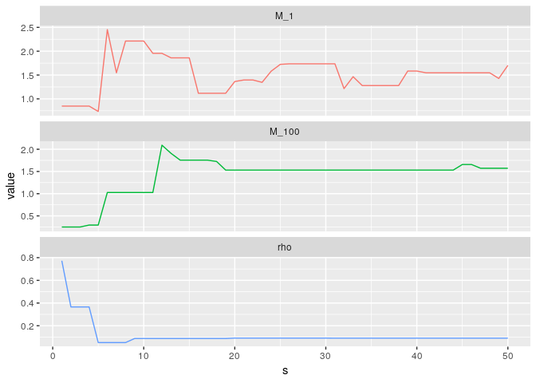
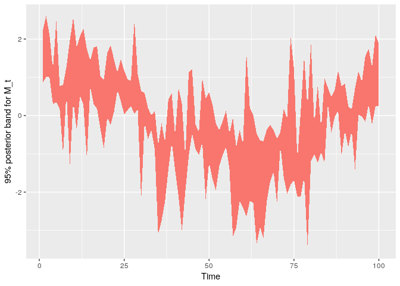
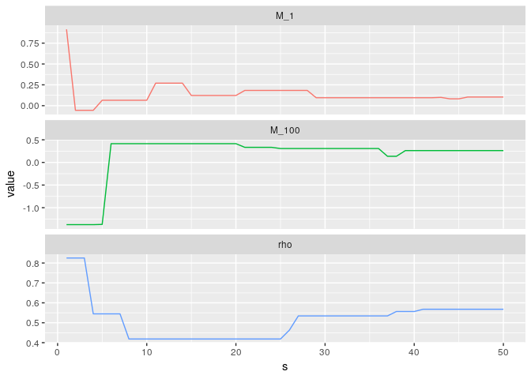

BIDC: Bayesian Inference for Default Correlations
================

Installation
------------

``` r
if (!require(devtools)) {
    install.packages('devtools')
}
devtools::install_github('miguelbiron/BIDC')
```

Description
-----------

BIDC is a package that aims to provide multiple tools for performing Bayesian inference on the default correlation of a given portfolio, along with any other latent factor. Currently, we support only one model, but we would like to expand this in the future.

The available model is a generalization of the finite version of the Vasicek model for correlated defaults, which allows for clients with different probabilities of default (PD). The main data input corresponds to a matrix *Y* of size *N* × *T*, where *T* is the amount of periods observed and *N* is the number of individuals observed each period, which for simplicity we assume constant. Then, *Y* contains a value of 1 at position (*n*, *t*) if at time *t* the n-th client defaulted.

In order to infer (*ρ*, {*M*<sub>*t*</sub>}<sub>*t*</sub>) we use the assumption that the PDs are exogenous. Hence, the user needs to supply anothe matrix *P* of the same dimensions as *Y*, which at the position (*n*, *t*) should containt a good estimate of the PD for the corresponding value in *Y*.

It is crucial to understand that *Y* is **exchangeable within columns**: for *t*<sub>1</sub> ≠ *t*<sub>2</sub>, the value at (*n*, *t*<sub>1</sub>) is not necessarily associated with the same client that the value at (*n*, *t*<sub>2</sub>) is. In other words, we could reshufle each column and still obtain the same information. However, the matrix *P* has to be reshuffled in the same way to maintain consistency.

Example
-------

Let us start by defining a function that will let us obtain simulated data. We simulate the latent factors {*M*<sub>*t*</sub>}<sub>*t*</sub> as coming from an AR(1) process, so that the output resembles a business cycle.

Note that the function returns the binary matrix *Y*, and also the actual PDs used to sample *Y*.

``` r
sample_data = function(N, Tau, rho, median_pd, a){
  # N: number of individuals
  # Tau: time steps
  # rho: default correlation
  # median_pd: median marginal probability of default
  # a: AR(1) param for M_t process
  # output: list with: y  : matrix size N \times Tau of integers in (0,1)
  #                    p_d: matrix size N \times Tau of PDs

  # sample M_t process
  M = numeric(Tau)
  M[1L] = rnorm(1L)
  for(tau in 2L:Tau) M[tau] = a*M[tau-1L] + sqrt(1-a^2)*rnorm(1L)

  # sample critical values
  x_c = matrix(rnorm(N*Tau, mean = qnorm(median_pd)),
               nrow = N)

  # sample y_it
  y = matrix(NA_integer_, nrow = N, ncol = Tau)
  for(tau in 1L:Tau) {
    prob = pnorm((x_c[,tau]-sqrt(rho)*M[tau])/sqrt(1-rho))
    y[,tau] = 1L*(runif(N) <= prob)
  }

  p_d = pnorm(x_c) # probit to get probabilities
  return(list(y=y,p_d=p_d))
}
```

Now we sample the actual data. We set a value of *ρ* = 0.15.

``` r
set.seed(1313)

# parameters for simulated data
N = 1000L # number of individuals
Tau = 100L # time steps
rho = 0.15 # default correlation
median_pd = 0.25 # median marginal probability of default
a = 0.9 # AR(1) param for M_t process

# get data
l_data = sample_data(N=N,Tau=Tau,rho=rho,median_pd=median_pd,a=a)
```

We are now ready to run the chain. We will do this for 1,000 iterations. Note that we will supply the exact PDs that were used to simulate the data. This is the best case scenario for our method.

``` r
library(BIDC)

S = 50L # number of iterations
chain = bidc_pd(S=S, y=l_data$y, p_d=l_data$p_d, verbose = 0L)
```

### Trace plots

The trace plot for *ρ* show that the chain converges rapidly to a region close to the true value, and then slows down.

``` r
suppressPackageStartupMessages(library(dplyr))
suppressPackageStartupMessages(library(tidyr))
suppressPackageStartupMessages(library(ggplot2))

chain[,c(1L, Tau, Tau+1L)] %>%
  as.data.frame() %>%
  setNames(c("M_1", paste0("M_", Tau), "rho")) %>%
  mutate(s = seq_len(nrow(.))) %>%
  gather(select = -"s") %>%
  ggplot(aes(x = s, y = value, colour = key)) +
  geom_line(show.legend = FALSE) +
  facet_wrap(~key, scales = "free_y", ncol = 1L)
```



### Confidence band for *M*<sub>*t*</sub>

``` r
chain[,-(Tau+1L)] %>%
  as_tibble() %>%
  setNames(1L:ncol(.)) %>%
  mutate(s=1L:nrow(.)) %>%
  gather("tau", "M", select = -s) %>%
  mutate(tau=as.integer(tau)) %>%
  group_by(tau) %>%
  summarise(qtiles = list(data.frame(
    q   = c(".025", ".975"),
    val = quantile(M, c(0.025, 0.975)),
    stringsAsFactors = FALSE
  ))) %>%
  ungroup() %>%
  unnest() %>%
  spread(q, val) %>%
  ggplot(aes(x=tau, ymin=`.025`, ymax=`.975`, fill = "1")) +
  geom_ribbon(show.legend = FALSE) +
  labs(x = "Time",
       y = "95% posterior band for M_t")
```



Example with bad estimates of the PD
------------------------------------

Now, we are going to run the chain again, but instead of using the true PDs, we will be a noisy version, which is shrunken towards the median PD with a random intensity. This is to demonstrate that our approach is very sensitive to the quality of the PDs used.

We draw the mixing coefficient from a Beta distribution that is centered around 0.2. We do this type of perturbation because we assume that, even though the user might have a bad PD model, it will at least be able to estimate well the overall PD.

``` r
mix_c = matrix(rbeta(N*Tau, shape1 = 2, shape2 = 5), nrow = N)
p_d_noisy = mix_c*median_pd + (1-mix_c)*l_data$p_d
chain = bidc_pd(S=S, y=l_data$y, p_d=p_d_noisy, verbose = 0L)
```

### Trace plots

We see now that the trace for *ρ* is very far away from the true value.

``` r
suppressPackageStartupMessages(library(dplyr))
suppressPackageStartupMessages(library(tidyr))
suppressPackageStartupMessages(library(ggplot2))

chain[,c(1L, Tau, Tau+1L)] %>%
  as.data.frame() %>%
  setNames(c("M_1", paste0("M_", Tau), "rho")) %>%
  mutate(s = seq_len(nrow(.))) %>%
  gather(select = -"s") %>%
  ggplot(aes(x = s, y = value, colour = key)) +
  geom_line(show.legend = FALSE) +
  facet_wrap(~key, scales = "free_y", ncol = 1L)
```



### Confidence band for *M*<sub>*t*</sub>

Compare this with the case of perfect information.

``` r
chain[,-(Tau+1L)] %>%
  as_tibble() %>%
  setNames(1L:ncol(.)) %>%
  mutate(s=1L:nrow(.)) %>%
  gather("tau", "M", select = -s) %>%
  mutate(tau=as.integer(tau)) %>%
  group_by(tau) %>%
  summarise(qtiles = list(data.frame(
    q   = c(".025", ".975"),
    val = quantile(M, c(0.025, 0.975)),
    stringsAsFactors = FALSE
  ))) %>%
  ungroup() %>%
  unnest() %>%
  spread(q, val) %>%
  ggplot(aes(x=tau, ymin=`.025`, ymax=`.975`, fill = "1")) +
  geom_ribbon(show.legend = FALSE) +
  labs(x = "Time",
       y = "95% posterior band for M_t")
```


TODO
----

-   Add more models
